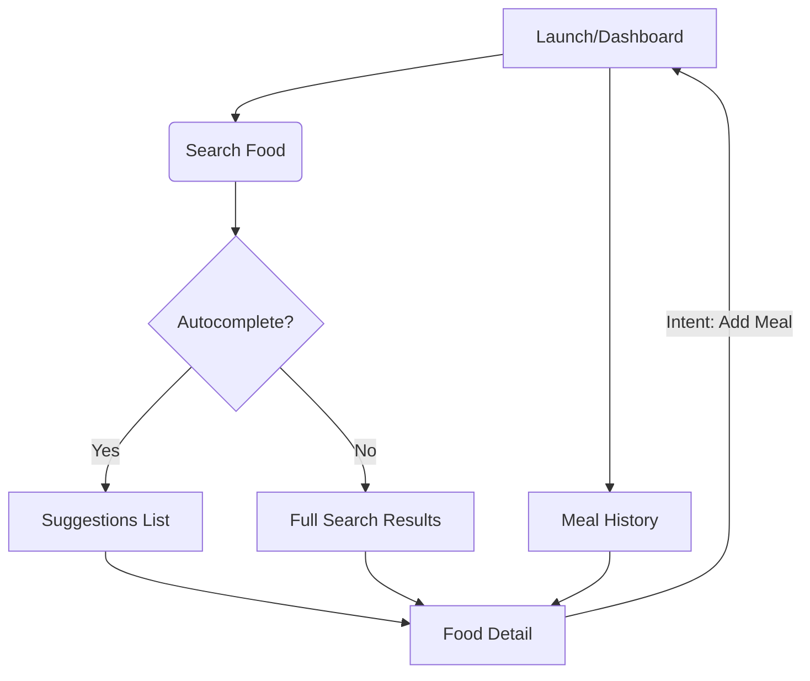

# Project Requirement Document (PRD): Food Tracker iOS App

## 1. Project Overview
The "Food Tracker" iOS app is a production-grade mobile application designed to help users search for food items, calculate nutritional values, and log meals. The app will leverage the existing "Food API" for data retrieval and processing, while providing a robust offline-first experience for meal logging.

### Objectives
- Provide a seamless, high-performance UI for food search and nutrition lookup.
- Implement an offline-first meal logging system (SwiftData/CoreData) that syncs with the server in the future.
- Use modern iOS development best practices: SwiftUI, Swift Concurrency, and MVI architecture.

---

## 2. Technology Stack
- **Framework:** SwiftUI
- **Architecture:** MVI (Model-View-Intent)
- **Concurrency:** Swift Concurrency (async/await, Task, Actors)
- **Local Persistence:** SwiftData (for offline meal storage)
- **Networking:** URLSession with async/await
- **OS Support:** iOS 17.0+ (to leverage latest SwiftUI and SwiftData features)

---

## 3. Architecture Pattern: MVI (Model-View-Intent)
The app will follow the MVI pattern to ensure a unidirectional data flow and predictable state management.

- **Model (State):** An immutable struct representing the current UI state (e.g., `SearchState`, `MealLogState`).
- **View:** SwiftUI views that observe the State and emit Intents.
- **Intent (Action):** Enumeration of user actions (e.g., `.search(query: String)`, `.addMealItem(item: FoodItem)`).
- **Container/Processor:** A logic layer (often a ViewModel or Actor) that processes Intents, updates the Model, and handles side effects (API calls, DB operations).

---

## 4. Detailed Feature List

### 4.1 Discovery & Search
- **Incremental Search:** Fetch results from `/autocomplete` as the user types (min 1 char).
- **Advanced Search:** Trigger a full search with filters using the `/search` endpoint.
- **Search Filters:**
  - Macro sliders: Protein Min, Calories Max, Carbs Max.
  - Sorting: Sort by name, calories, or protein density.
- **Recent Searches:** Store the last 5 successful searches locally for quick access.

### 4.2 Food & Nutrition Profiling
- **Nutrition Breakdown:** Interactive donut chart for Macro distribution (Protein/Carbs/Fat).
- **Unit Conversion:** Dropdown to select serving units (fetched from `/units`) and auto-calculate nutrition using `/nutrition`.
- **Micro-nutrition:** Toggle to show/hide micronutrients (Sodium, Fiber, etc.).

### 4.3 Meal Logging (Offline-First)
- **Multi-select Logging:** Add multiple food items to a single meal entry.
- **Offline Persistence:** Use **SwiftData** to persist meals immediately.
- **Meal History:** View logged meals by date.
- **Daily Progress:** Live-updating progress bars for daily macro goals.

---

## 5. Screen Breakdown

### 5.1 Dashboard Screen
- **State:** `DailySummaryState` (Total Calories, Macros, List of Today's Meals).
- **Intents:** `.refreshSummary`, `.deleteMeal(id: UUID)`.
- **UI:** Circular progress ring for calories, horizontal macro bars, list of cards for logged meals.

### 5.2 Search & Discovery Screen
- **State:** `SearchState` (Query, Results List, Loading Status, Error Message).
- **Intents:** `.updateQuery(String)`, `.toggleFilter(Filter)`, `.selectFood(FoodItem)`.
- **UI:** Search bar with autocomplete suggestions, categorized search results, filter button.

### 5.3 Food Detail Screen
- **State:** `FoodDetailState` (Food Info, Available Units, Selected Unit, Calculated Nutrition).
- **Intents:** `.changeUnit(Unit)`, `.updateWeight(Double)`, `.addMealItem`.
- **UI:** Hero image/icon, macro breakdown chart, unit picker, weight input field, "Add to Meal" floating action button.

### 5.4 Meal Log History
- **State:** `HistoryState` (Grouped meals by date, Selected date).
- **Intents:** `.changeDate(Date)`, `.editMeal(id: UUID)`.
- **UI:** Calendar ribbon, scrollable list of historical meals

---

## 6. UI/UX Requirements
- **Visual Identity:** A premium, high-contrast interface leveraging a unified brand palette for primary actions and background surfaces.
- **Layout Standards:** Rigorous adherence to a 4pt grid system with consistent margins and corner radii for all interactive elements.
- **Typography:** Unified hierarchy using distinct weights and sizes to ensure readability and professional structure.
- **Interactions:** Smooth micro-animations for transitions and haptic feedback on state-changing user actions.
- **Loading:** Shimmer-based skeleton loaders for all asynchronous operations.

---

## 7. Navigation Flow



---

## 8. API Mapping & Schemas

### 8.1 Search & Autocomplete
- **Autocomplete Endpoint:** `GET /autocomplete`
- **Request Parameters:** `q` (min 1 char), `limit`
- **Response Shape:**
  ```json
  [
    { "name": "Apple", "type": "generic" },
    { "name": "Apple Juice", "type": "branded" }
  ]
  ```

- **Search Endpoint:** `GET /search`
- **Request Parameters:** `q`, `limit`, `offset`, `protein_min`, `calories_max`.
- **Response Shape:**
  ```json
  [
    {
      "name": "Greek Yogurt",
      "type": "generic",
      "calories": 59,
      "protein": 10.2,
      "carbs": 3.6,
      "fat": 0.4
    }
  ]
  ```

### 8.2 Nutrition & Units
- **Unit Info Endpoint:** `GET /units`
- **Response Shape:**
  ```json
  [
    { "unit_name": "cup", "grams_equivalent": 245.0 },
    { "unit_name": "container", "grams_equivalent": 170.0 }
  ]
  ```

- **Nutrition Endpoint:** `GET /nutrition`
- **Logic:** Scaled nutrition = (Base Nutrition / 100) * Input Grams.

---

## 9. Core Data Models & MVI States

### 9.1 SwiftData Persistence Layer (Offline Storage)
The app uses **SwiftData** for all persistent storage. This ensures that users can log meals and view their history without an active internet connection.

#### Models & Relationships
- **`@Model class MealRecord`**
  - `id: UUID` (Attribute: `.unique`)
  - `timestamp: Date`
  - `mealType: String` (e.g., "Breakfast", "Lunch")
  - `items: [MealItemRecord]` (Relationship: `cascade` delete)
  - `isSynced: Bool = false` (Flag for future server sync)
- **`@Model class MealItemRecord`**
  - `foodId: Int`
  - `name: String`
  - `grams: Double`
  - `calories: Double`
  - `protein: Double`
  - `carbs: Double`
  - `fat: Double`
  - `meal: MealRecord?` (Inversed Relationship)

#### Data Lifecycle Logic
1. **Creation:** When a user adds food, a `MealItemRecord` is created and appended to a `MealRecord`.
2. **Caching:** Search results are **not** persisted in SwiftData (Volatile State), but selected food items are cached in the `MealItemRecord` to ensure the diary remains readable offline.
3. **Migration:** Initial schema is Version 1. Future updates must handle schema migrations if macros or relationship structures change.

### 8.2 Domain Models (Codable)
- **`FoodItem`:** Transient model for API responses (matched with Section 7.1).

### 8.3 MVI State Logic
Each screen's `Processor` must handle:
1. **Load Phase:** Query SwiftData via `@Query` or a background `ModelContext`.
2. **Sync Pulse:** Periodically check `isSynced == false` records and attempt server push if online.

---

## 9. Error Handling & Edge Cases
- **Network Failure:** Show "Offline" banner; allow meal logging regardless.
- **Empty Search:** Show "No results found" with a "Clear Filters" CTA.
- **Validation:** Weight input must be > 0.
- **API Unavailability:** Gracefully degrade to cached results from the last 24h.

---

## 10. Verification Plan

### Automated Tests
- **Unit Tests:** Verify MVI State transitions for each feature.
- **Mock API Tests:** Test networking layer with static JSON responses.
- **SwiftData Tests:** Verify CRUD operations for local meal logging.

### Manual Verification
- Verify search functionality with various filter combinations.
- Test offline behavior by disabling networking and adding meal items.
- Verify that daily totals update correctly when a new meal is logged.
